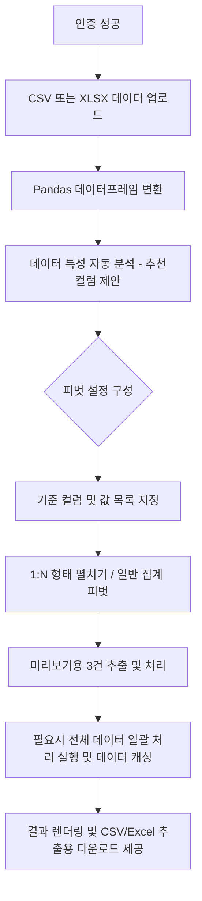

# 📊 데이터 펼치기 도구 (Data Pivot Tool)

CSV/Excel 파일 업로드 기능을 통해 데이터를 불러온 뒤, **동적 피벗 테이블**을 생성하여 결과를 Excel 및 CSV로 다운로드할 수 있는 Streamlit 웹 애플리케이션입니다. 특히 1:N 관계의 데이터를 펼쳐 한눈에 파악하기 편리하도록 직관적인 UI/UX를 제공합니다.

---

## 📋 주요 기능

### 1. 로그인 인증
- `streamlit-authenticator` 라이브러리를 활용한 **쿠키 기반 인증**
- `.streamlit/secrets.toml`에서 사용자 계정 및 쿠키 설정 관리
- 사이드바에서 현재 로그인한 사용자 정보 및 로그아웃, 업로드된 데이터 현황(행/열 수 등) 위젯 제공

### 2. 데이터 소스 업로드
- **CSV 가용성**: UTF-8 및 CP949 인코딩 자동 감지 기능 지원
- **Excel 가용성**: 최적화된 고속 엑셀 처리 엔진(`calamine`)을 사용하여 `.xlsx` 파일을 빠르게 로드
- 업로드된 데이터의 컬럼별 타입 추정, 고유값 및 NULL 비율 등 상세 정보 열람 제공

### 3. 피벗 설정 기능

업로드한 데이터의 피벗 방식을 자동 추천받거나 세밀하게 설정할 수 있습니다.

#### 💡 피벗 대상 컬럼 추천 분석 (길잡이 기능)
- 전체 행 대비 컬럼의 고유값 비율을 분석하여 `기준 컬럼 후보`(반복되는 공통 정보)와 `펼칠 데이터 후보`(상세 정보)를 자동으로 제안합니다. 일반 사용자도 쉽게 방향을 잡을 수 있습니다.

#### 📌 1:N 데이터 펼치기 모드
- 1:N 관계의 상세 데이터를 **가로로 늘어뜨려** 한 환자(또는 한 건)당 1개의 행에 모든 값을 표시합니다.
- 값 컬럼에 **문자열/날짜 등 모든 데이터 타입** 선택 가능
- **고급 상세 설정 지원**:
  - 최대 펼치기 건수 제한 기능 (과도한 열 생성을 방지)
  - 값이 중복될 경우의 취합 방식 지정 (첫 번째 값, 마지막 값, 가장 작거나 큰 값 활용)
  - 가로로 펼칠 결과 컬럼의 이름(접두어) 사용자 정의 지원
  - 생성된 컬럼의 정렬 순서를 그룹별로 할지 혹은 순번(_1, _2...)별로 할지 지정

#### 📌 일반 집계 피벗 모드 (Classic Pivot)
- 기존 Excel 환경처럼 원하는 수치 데이터를 집계합니다.
- **열(Columns)**: 지정한 컬럼명들의 값이 새로운 열이 됩니다. (선택형)
- **값(Values)**: 집계할 숫자형 데이터만 제한적으로 표시합니다.
- **집계 함수**: `sum`, `mean`, `count`, `min`, `max`, `first`

#### 🔍 조건부 데이터 필터링
- 데이터량이 너무 많을 때, 분석에 불필요한 값을 걸러내기 위한 단일 조건 필터를 지원합니다 (체크박스 선택 방식 및 포함어구 검색 지원).

### 4. 결과 및 데이터 비교
- **미리보기**: 전체 데이터를 연산하기 전에, 상위 3개 그룹을 미리보여주어 옵션이 제대로 설정되었는지 즉시 파악 가능.
- **원본 ↔ 결과 구조 비교**: 기존의 세로 구조 데이터와 가로로 늘어진 형태가 서로 어떻게 변환되었는지를 한 눈에 대조할 수 있는 토글 뷰를 제공합니다.
- 렌더링 부하 방지를 위해 최대 5,000건의 행만 표시합니다.

### 5. 결과 다운로드
- 펼쳐진 최종 결과를 **Excel(.xlsx)** 파일 밎 **CSV** 파일로 즉시 다운로드할 수 있습니다.

---

## 🛠️ 기술 스택

| 구분 | 기술 |
|---|---|
| **프레임워크** | [Streamlit](https://streamlit.io/) |
| **데이터 처리** | [Pandas](https://pandas.pydata.org/) |
| **엑셀 로더** | [calamine](https://github.com/tafia/calamine) |
| **인증 관리** | [streamlit-authenticator](https://github.com/mkhorasani/Streamlit-Authenticator) |
| **Excel 엑스포트**| [openpyxl](https://openpyxl.readthedocs.io/) |

---

## 📁 프로젝트 구조

```text
pivot/
├── .streamlit/
│   └── secrets.toml          # 인증 정보 및 쿠키 설정 (비공개)
├── pivot.py                  # 메인 애플리케이션 소스
├── generate_keys.py          # (선택) 비밀번호 해시 생성 보조 스크립트
└── README.md
```

---

## ⚙️ 설치 및 실행

### 1. 의존성 패키지 설치

```bash
pip install streamlit pandas streamlit-authenticator openpyxl calamine
```

### 2. 비밀번호 해시 생성

`generate_keys.py` 유틸리티를 활용하여 사용할 관리자의 비밀번호를 해시(`bcrypt`)로 변환합니다.

### 3. 인증 설정

`.streamlit/secrets.toml` 파일을 생성 및 작성합니다:

```toml
[credentials.usernames.admin]
name = "관리자"
password = "$2b$12$..."   # 해시화된 비밀번호 값

[cookie]
name = "pivot_auth_cookie"
key = "your-random-secret-key"
expiry_days = 30
```

### 4. 앱 실행

```bash
streamlit run pivot.py
```

---

## 🔄 데이터 파이프라인 흐름



---

## 📌 핵심 아키텍처 특성

- **Null/DataType 자동 컨버팅**: Index와 값으로 사용될 모든 데이터 유형의 예외 상황(예: Timestamp, NaN 혼합 등)을 방지하기 위해 스트링으로 통일 변환하거나 0/Null 표기 처리를 일괄 수행하여 처리 안정성 도모
- **캐싱 및 상태 유지**: Streamlit의 Re-render 주기에 대응해 `st.session_state`를 통한 임시 결과물과 엑셀 버퍼를 메모리에 임시 캐싱하므로 반복된 무거운 계산 및 로딩을 지연시킴
- **다중 인덱스 평탄화 알고리즘 (Flat MultiIndex)**: Pandas `pivot_table` 실행 후 산출되는 그룹형 MultiIndex를 `진단명_1`, `약품명_2` 처럼 플랫한 단일 레벨 명칭으로 자동 변환해 실무에 즉시 투입 가능한 테이블 폼 유지

---

## 📝 라이선스

내부 프로젝트 용도 — 무단 배포 및 외부 공유를 금지합니다.
