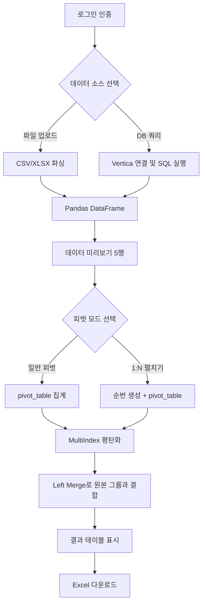

# 📊 통합 데이터 피벗 도구 (Data Pivot Tool)

CSV/Excel 파일 업로드 또는 Vertica DB 직접 쿼리를 통해 데이터를 불러온 뒤, **동적 피벗 테이블**을 생성하고 결과를 Excel로 다운로드할 수 있는 Streamlit 웹 애플리케이션입니다.

---

## 📋 주요 기능

### 1. 로그인 인증
- `streamlit-authenticator` 라이브러리를 활용한 **쿠키 기반 인증**
- `.streamlit/secrets.toml`에서 사용자 계정 및 쿠키 설정 관리
- 비밀번호는 `generate_keys.py`를 통해 **bcrypt 해시** 생성 후 저장

### 2. 데이터 소스 (탭 기반 전환)

| 탭 | 설명 |
|---|---|
| **📁 파일 업로드** | CSV(UTF-8/CP949 자동 감지) 또는 XLSX 파일 업로드 |
| **🗄️ Vertica DB 쿼리** | Host, Username, Password, Database 입력 후 SQL 직접 실행 |

### 3. 피벗 테이블 생성

두 가지 모드를 지원합니다:

#### 📌 일반 피벗 모드
- **행(Index)**: 기준이 될 컬럼 (다중 선택)
- **열(Columns)**: 가로로 펼칠 컬럼 선택
- **값(Values)**: 숫자형 컬럼만 선택 가능
- **집계 함수**: `sum`, `mean`, `count`, `min`, `max`, `first`

#### 📌 1:N 펼치기 모드 (Sequence Pivot)
- 1:N 관계의 상세 데이터를 **가로로 늘어뜨려** 한 행에 표시
- 열은 자동 순번(1, 2, 3…)으로 생성
- 값 컬럼에 **문자열/날짜 등 모든 타입** 선택 가능
- 집계 함수: `first`, `last`, `min`, `max`

### 4. 결과 다운로드
- 피벗 결과를 **Excel(.xlsx)** 파일로 즉시 다운로드
- `openpyxl` 엔진 기반

---

## 🛠️ 기술 스택

| 구분 | 기술 |
|---|---|
| **프레임워크** | [Streamlit](https://streamlit.io/) |
| **데이터 처리** | [Pandas](https://pandas.pydata.org/) |
| **데이터베이스** | [Vertica](https://www.vertica.com/) (vertica_python) |
| **인증** | [streamlit-authenticator](https://github.com/mkhorasani/Streamlit-Authenticator) |
| **Excel 출력** | [openpyxl](https://openpyxl.readthedocs.io/) |

---

## 📁 프로젝트 구조

```
pivot/
├── .streamlit/
│   └── secrets.toml          # 인증 정보 및 쿠키 설정 (비공개)
├── pivot.py                   # 메인 애플리케이션
├── generate_keys.py           # 비밀번호 해시 생성 유틸리티
└── README.md
```

---

## ⚙️ 설치 및 실행

### 1. 의존성 설치

```bash
pip install streamlit pandas vertica-python streamlit-authenticator openpyxl
```

### 2. 비밀번호 해시 생성

`generate_keys.py`을 수정하여 원하는 비밀번호를 해시화합니다:

```bash
python generate_keys.py
```

출력된 해시값을 `secrets.toml`에 입력합니다.

### 3. 인증 설정

`.streamlit/secrets.toml` 파일을 아래 형식으로 작성합니다:

```toml
[credentials.usernames.admin]
name = "관리자"
password = "$2b$12$..."   # generate_keys.py로 생성한 해시값

[cookie]
name = "pivot_auth_cookie"
key = "your-random-secret-key"
expiry_days = 30
```

### 4. 실행

```bash
streamlit run pivot.py
```

---

## 🔄 데이터 흐름



---

## 📌 주요 특징

- **NULL 안전 처리**: Index/Columns/Values 컬럼별 타입을 감지하여 날짜(`strftime`)·숫자(`astype(str)`)·문자열(`fillna`) 각각 안전하게 변환
- **MultiIndex 평탄화**: 피벗 결과의 2단 MultiIndex 컬럼을 `값_순번` 형태의 단일 컬럼으로 자동 변환
- **인코딩 자동 감지**: CSV 파일 로드 시 UTF-8 → CP949 순서로 자동 시도
- **쿠키 기반 세션 유지**: 로그인 후 설정된 기간 동안 재인증 없이 접속 가능

---

## 📝 라이선스

내부 프로젝트 — 무단 배포 및 외부 공유를 금지합니다.
